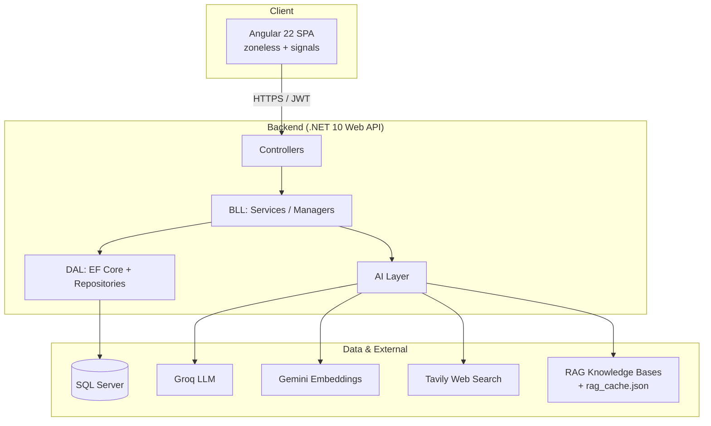
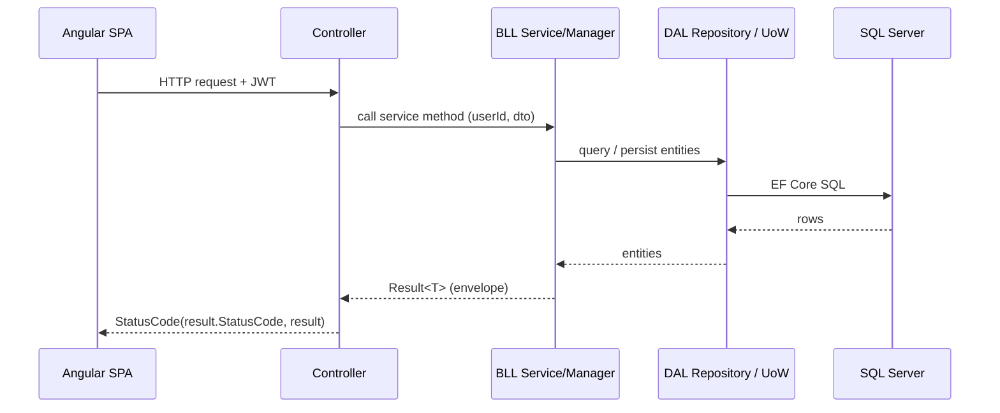
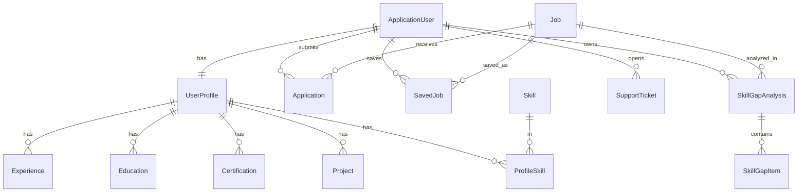
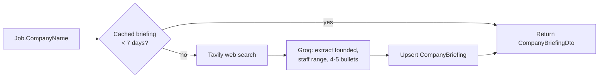
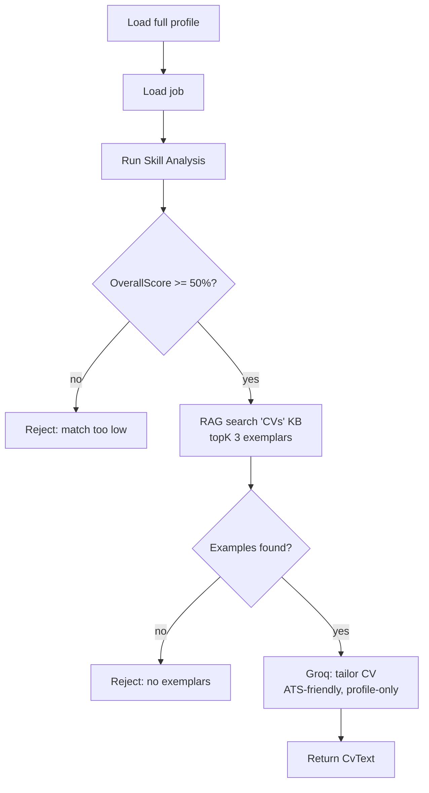
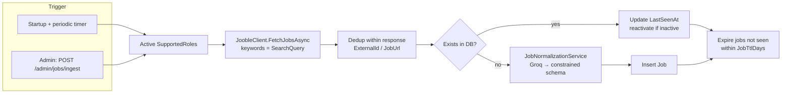

# CVHack — Engineering & Architecture Documentation

> A senior-level technical reference for the CVHack platform: an AI-assisted job-search and career-preparation system. This document explains **what the system is, how it is structured, and why the key design decisions were made**, and provides reference tables for the database, API surface, AI agents, and RAG pipeline.

**Audience:** project evaluators and engineers reviewing the system design.
**Scope:** database, backend, frontend, AI agents, and the RAG pipeline, plus cross-cutting concerns and known limitations.

---

## Table of Contents

1. [System Overview](#1-system-overview)
2. [Technology Stack](#2-technology-stack)
3. [Solution Layout](#3-solution-layout)
4. [Backend Architecture](#4-backend-architecture)
5. [Database](#5-database)
6. [Frontend Architecture](#6-frontend-architecture)
7. [AI Agents](#7-ai-agents)
8. [RAG Pipeline](#8-rag-pipeline)
9. [Job Ingestion Pipeline](#9-job-ingestion-pipeline)
10. [Cross-Cutting Concerns](#10-cross-cutting-concerns)
11. [Known Limitations & Technical Debt](#11-known-limitations--technical-debt)
12. [Local Setup](#12-local-setup)

---

## 1. System Overview

CVHack is a career platform where **job seekers** browse aggregated job listings and use a set of AI agents to prepare their applications, while **admins** manage users and support tickets. The AI capabilities are the distinguishing feature: every agent is **grounded** — either in the user's own profile, in live web-search results, or in a curated knowledge base via retrieval-augmented generation (RAG) — to keep outputs factual rather than hallucinated.

The system is a classic **decoupled SPA + Web API** split, with a dedicated AI integration layer and a document-grounded RAG subsystem.



**Two user roles** drive access control end-to-end:

- **JobSeeker** — profile, job search, saved jobs, AI agents (skill analysis, company briefing, CV generation, mock interview), support tickets.
- **Admin** — dashboard, user management (promote/suspend/plan), support ticket handling.

---

## 2. Technology Stack

| Layer      | Technology                                 | Notes                                                    |
| ---------- | ------------------------------------------ | -------------------------------------------------------- |
| Frontend   | Angular 22 (standalone, **zoneless**)      | Signals-based reactivity, lazy-loaded routes             |
| Styling    | Tailwind CSS v4                            | CSS variables for theming (light/dark)                   |
| Backend    | .NET 10 Web API (C#)                       | Layered N-tier                                           |
| ORM        | Entity Framework Core                      | Code-first migrations, SQL Server provider               |
| Database   | SQL Server (SQLEXPRESS local)              | ASP.NET Identity for auth tables                         |
| Auth       | JWT Bearer + ASP.NET Identity              | Role + policy based authorization                        |
| LLM        | **Groq** (`llama-3.3-70b-versatile`)       | OpenAI-compatible endpoint via `Microsoft.Extensions.AI` |
| Embeddings | **Google Gemini** (`gemini-embedding-001`) | Direct HTTP, used by the RAG pipeline                    |
| Web search | **Tavily**                                 | Grounds the Company Researcher agent                     |
| Job source | **Jooble**                                 | External job-listing API feeding the ingestion pipeline  |
| API docs   | OpenAPI + **Scalar**                       | Interactive reference at `/scalar/v1` (Development)      |

---

## 3. Solution Layout

The backend follows a **strict layered (N-tier) architecture**. Dependencies flow inward: the API depends on the BLL, which depends on the DAL; the AI layer is a peer integration library consumed by the BLL and (for minimal-API agents) the API.

```
CVHack.slnx
├── CVHack.API      → Controllers, Program.cs, minimal-API endpoints, OpenAPI transformers
├── CVHack.BLL      → Services/Managers, DTOs, FluentValidation validators, DI composition
├── CVHack.DAL      → EF entities, configurations, repositories, UnitOfWork, AppDbContext, migrations
├── CVHack.Common   → Result<T> envelope (shared primitives)
└── CVHack.AI       → LLM/embedding/search clients, AI agents, RAG pipeline
```

**Design rationale:** the layering keeps the domain logic (BLL) free of HTTP and persistence concerns, and isolates all third-party AI SDKs inside `CVHack.AI` behind interfaces (`IChatClient`, `IEmbeddingService`, `IWebSearchClient`, `IRagService`). This means a provider can be swapped (e.g. Groq → another OpenAI-compatible LLM) by changing a single registration file, without touching business logic.

---

## 4. Backend Architecture

### 4.1 Layered request flow



Controllers are intentionally **thin**: they extract the caller identity (`User.GetUserId()`), delegate to a BLL service, and translate the returned `Result<T>` into an HTTP response via `StatusCode(result.StatusCode, result)`. No business logic lives in controllers.

### 4.2 The `Result<T>` envelope

Every service returns a uniform envelope (`CVHack.Common`), which serializes to camelCase JSON:

```json
{
  "isSuccess": true,
  "statusCode": 200,
  "message": "Jobs retrieved successfully.",
  "data": {},
  "errors": []
}
```

This gives the frontend a **single, predictable response contract**: services unwrap `res.data` on success and surface `res.message` / `res.errors` on failure. It also decouples HTTP status selection from the controller — the service decides the status code, the controller just forwards it.

### 4.3 Authentication & authorization

- **JWT Bearer** tokens are issued on register/login (`AuthService`), signed with `JwtSettings:Key`, carrying `NameIdentifier`, `Email`, and `Role` claims.
- **Registration** auto-issues a token (immediate login) and creates an **empty `UserProfile`** so profile endpoints have a row to populate.
- **Suspended-account gate:** `LoginAsync` rejects users whose `Status == "Suspended"` with `403`, after password verification. (Note: existing tokens remain valid until expiry — JWTs are stateless.)
- **Policies:** `AdminOnly` (role `Admin`) and `JobSeekerOnly` (role `JobSeeker`) are applied at the controller level. A `ClaimsPrincipal.GetUserId()` extension centralizes identity extraction.

### 4.4 API reference

All routes are prefixed with `/api`. **Auth** column: 🔓 anonymous · 🔒 any authenticated · 👤 JobSeeker · 🛡️ Admin.

**Authentication**

| Method | Route                      | Auth | Purpose                                     |
| ------ | -------------------------- | ---- | ------------------------------------------- |
| POST   | `/auth/register/jobseeker` | 🔓   | Register + auto-login, create empty profile |
| POST   | `/auth/login`              | 🔓   | Login (blocks suspended accounts)           |

**Jobs & AI (per-job)**

| Method | Route                       | Auth | Purpose                                      |
| ------ | --------------------------- | ---- | -------------------------------------------- |
| GET    | `/jobs`                     | 🔒   | List all jobs                                |
| GET    | `/jobs/{id}`                | 🔒   | Job detail                                   |
| GET    | `/jobs/{id}/briefing`       | 🔒   | **Company Researcher** agent                 |
| GET    | `/jobs/{id}/skill-analysis` | 🔒   | **Skill Analysis / Match** agent             |
| GET    | `/cv/generate/{jobId}`      | 🔒   | **CV Generator** agent                       |
| POST   | `/interview/start`          | 🔒   | **Interview Coach** — begin session          |
| POST   | `/interview/answer`         | 🔒   | **Interview Coach** — answer + next question |

**Profile domain** (all 👤 JobSeeker): `/profile`, `/profile/skills`, `/skills`, `/projects`, `/education`, `/experience`, `/certification` — CRUD over the profile sub-entities.

**Saved jobs / applications** (🔒): `/savedjobs`, `/applications`.

**Support** (👤): `/tickets` (create/list/detail). **Admin support** (🛡️): `/admin/tickets` (list/detail/update status).

**Admin users** (🛡️ `AdminOnly`): `/admin/users` (list/detail), `/admin/users/{id}/promote`, `/admin/users/{id}/status`, `/admin/users/{id}/plan`.

**Admin jobs** (🛡️ `AdminOnly`): `POST /admin/jobs/ingest?roleTitle=` — manually trigger a job-ingestion run (§9); fire-and-forget, returns `202 Accepted` or `409 Conflict` if a run is already in progress.

**RAG test endpoints** (development utilities): `/rag/documents`, `/rag/chunks`, `/rag/embed-test`, `/rag/search?query=...`.

---

## 5. Database

EF Core **code-first**. The schema centers on the **user → profile → profile sub-entities** aggregate and the **job → analysis** relationships, plus ASP.NET Identity tables (`AspNetUsers` etc., extended by `ApplicationUser`).

### 5.1 Entity-relationship overview



`CompanyBriefing` is a standalone cache table keyed by company name (not FK-linked to `Job`), so briefings are reused across every job from the same company. `SupportedRole` is likewise standalone (not FK-linked): it is the configuration list that drives the job-ingestion pipeline (§9).

### 5.2 Entity reference (selected key fields)

**ApplicationUser** (extends `IdentityUser`)

| Field                | Type     | Notes                                              |
| -------------------- | -------- | -------------------------------------------------- |
| FirstName / LastName | string   | Display name                                       |
| CreatedAt            | DateTime |                                                    |
| Plan                 | string   | `"Free"` (default) / `"Pro"`                       |
| Status               | string   | `"Active"` (default) / `"Suspended"` — gates login |
| Searches             | int      | Usage counter, starts at 0                         |

**UserProfile** — 1:1 with user; holds `Headline`, `Summary`, `City`, `Country`, `PhoneNumber`, social URLs (`LinkedInUrl`, `GitHubUrl`, `PortfolioUrl`), `JobTitle`, timestamps. Parent of `Experience`, `Education`, `Certification`, `Project`, and `ProfileSkill`.

**Skill / ProfileSkill** — `Skill(Id, Name)` is a shared catalog; `ProfileSkill` is the join entity giving a many-to-many between profiles and skills.

**Job**

| Field                              | Notes                                                        |
| ---------------------------------- | ------------------------------------------------------------ |
| Title, CompanyName, SourcePlatform | Provenance (`SourcePlatform` = `"Jooble"`)                   |
| Description, BriefDescription?     | Full text + short LLM summary                                |
| City, Country                      | Split location (data-driven filters)                         |
| Seniority, WorkType, WorkTime      | Enumerated filter dimensions (normalized to fixed enums)     |
| SalaryMin, SalaryMax               | decimal                                                      |
| JobUrl, PostedAt                   | External link + date                                         |
| ExternalId?                        | Source-side id; unique per `(SourcePlatform, ExternalId)`    |
| IsActive                           | Soft-delete flag; set `false` when a listing ages out (TTL)  |
| LastSeenAt                         | Last time the listing was seen in a fetch (drives TTL)       |
| Responsibilities?, Requirements?   | JSON arrays of short bullet strings (LLM-extracted)          |

Populated by the job-ingestion pipeline (§9). The filtered unique index on `(SourcePlatform, ExternalId)` makes re-ingestion idempotent.

**SupportedRole** — configuration for the ingestion pipeline: `Title` (stable internal identifier), `SearchQuery?` (keyword sent to Jooble), `IsActive` (default `true`), `LastIngestedAt?`. Reconciled from code on every startup (§9.2).

**SkillGapAnalysis** (parent) — `UserId`, `JobId`, `OverallScore`, `OverallSummary`, **`ProfileHash`** (cache-invalidation fingerprint), `UpdatedAt`. One per `(user, job)`.

**SkillGapItem** (child) — `SkillName`, `MatchPercent`, `Severity`, `Category`, `ActionType`, `WhyItMatters`, `SuggestedStep`. The per-requirement breakdown.

**CompanyBriefing** — `CompanyName`, `Founded?`, `StaffMin?`, `StaffMax?`, `Content` (JSON bullet list), `UpdatedAt` (7-day TTL).

**SupportTicket** — `UserId`, `Subject`, `Category`, `Description`, `Status`, `Reply?`, `CreatedAt`, `UpdatedAt?`.

### 5.3 Migrations

The schema is versioned with EF Core migrations (PMC: default project `CVHack.DAL`, startup `CVHack.API`). Cache-invalidation for AI features is achieved through **content fingerprints** (`ProfileHash`) rather than timestamps, because the child entities that feed an analysis carry no `UpdatedAt` of their own — a SHA-256 hash of the ordered profile signature is the robust "has the profile changed?" signal.

---

## 6. Frontend Architecture

### 6.1 Zoneless + signals

The SPA runs Angular in **zoneless** change-detection mode (no `zone.js`). This is the single most important frontend design fact: **asynchronous callbacks do not automatically trigger re-render.** Consequently, all mutable UI state (loading flags, error messages, fetched lists, pagination) is held in **signals** (`signal()`, `computed()`), so that setting a value inside an HTTP subscription reliably updates the view.

**Rationale:** zoneless removes the `zone.js` monkey-patching overhead and makes change detection explicit and predictable — at the cost of requiring disciplined signal usage. The trade-off suits a signals-first Angular 22 codebase.

### 6.2 Routing, guards, and the HTTP interceptor

Routes are **lazy-loaded** (`loadComponent`) and protected by functional guards:

| Route                                                | Guard            | Access                              |
| ---------------------------------------------------- | ---------------- | ----------------------------------- |
| `/`, `/home`                                         | —                | Public landing page (any visitor)   |
| `/login`, `/register`                                | `guestGuard`     | Only when logged out                |
| `/jobs`, `/jobs/:id`, `/mock-interview/:id`          | `authGuard`      | Any authenticated user              |
| `/profile`, `/support`                               | `jobSeekerGuard` | JobSeeker only (admins → not-found) |
| `/admin/dashboard`, `/admin/tickets`, `/admin/users` | `adminGuard`     | Admin only                          |
| `**`                                                 | —                | Not-found fallback                  |

A functional **HTTP interceptor** attaches the `Bearer` token to outgoing requests and centrally handles `401` (token expiry → logout → redirect to login with a `sessionExpired` flag).

### 6.3 Services and the response contract

Each domain has an Angular service (`auth.service`, `jobs.service`, `admin-users.service`, profile sub-services, `support`, `theme.service`) that calls the API and **unwraps `res.data`** from the `Result<T>` envelope, mapping backend DTOs into frontend models. This mirrors the backend's uniform contract and keeps components ignorant of the envelope shape.

### 6.4 Feature areas

- **Landing** — public marketing entry page (`/` and `/home`): hero, feature highlights, and mission sections with an "Explore Jobs" CTA that routes to login. The only content page reachable while logged out besides auth; carries the theme toggle.
- **Auth** — login/register with client-side validation (email regex, disabled-until-valid), server error surfacing (including the suspended-account `403`).
- **Job search** — data-driven sidebar filters (country/city/work-type/work-time/seniority/salary derived from the loaded jobs), free-text search, sort, **client-side pagination (10/page)**, loading spinner and "no jobs found" empty state.
- **Job detail** — job info plus the AI cards (match analysis, company briefing).
- **Profile** — tabbed CRUD over personal info, skills, experience, education, projects, certifications (owned by a separate team member).
- **Admin** — dashboard (stats + charts), user management (promote/suspend/plan with confirmation and server-side rules), ticket management. A shared collapsible `admin-sidebar` (icon-only < lg, expanded ≥ lg) is used across all admin pages.
- **Mock interview** — chat UI driving the Interview Coach agent.
- **Theme** — light/dark persisted in `localStorage` and re-applied on load.

---

## 7. AI Agents

All agents share a common discipline: **the LLM is constrained by grounded context and explicit anti-hallucination rules.** The LLM never invents user skills, and where structured output is required it is parsed via `GetResponseAsync<T>(prompt, useJsonSchemaResponseFormat: false)` (JSON schema mode disabled for Groq compatibility).

### 7.1 Shared plumbing

| Concern          | Interface           | Implementation           | Provider / model               |
| ---------------- | ------------------- | ------------------------ | ------------------------------ |
| Chat / reasoning | `IChatClient`       | Groq registration        | Groq `llama-3.3-70b-versatile` |
| Embeddings       | `IEmbeddingService` | `GeminiEmbeddingService` | Gemini `gemini-embedding-001`  |
| Web search       | `IWebSearchClient`  | `TavilySearchClient`     | Tavily                         |
| Retrieval        | `IRagService`       | `RagService`             | In-memory vector store         |

Registration is composed in `CVHack.AI/DependencyInjection.cs` (`AddAiIntegrations`), with each provider isolated in its own registration file (`Chat/GroqChatClientRegistration`, `Embeddings/…`, `Search/…`).

### 7.2 Company Researcher

**Endpoint:** `GET /api/jobs/{id}/briefing` · **Grounding:** Tavily web search + Groq · **Cache:** `CompanyBriefing` table, 7-day TTL, keyed by company name.



**Division of labour:** Tavily provides raw, current facts (search snippets); the LLM's job is only to _extract and structure_ them (founding year, staff range, concise bullets) — never to supply facts from its own memory. This keeps briefings current and grounded.

### 7.3 Skill Analysis / Match

**Endpoint:** `GET /api/jobs/{id}/skill-analysis` · **Grounding:** user profile vs. job · **Cache:** `SkillGapAnalysis` per `(user, job)`, invalidated by **`ProfileHash`**.

The agent asks Groq to score the candidate against 5–8 job requirements, producing an `OverallScore`, an `OverallSummary`, and a per-requirement breakdown (`SkillGapItem`s with match %, severity, category, and — for gaps — why it matters and a suggested step).

Notable design decisions:

- **Cache invalidation by content hash.** The response is cached and only regenerated when `ProfileHash` (SHA-256 of an ordered profile signature) changes — because staleness here is _profile-driven_, not time-driven.
- **Seniority is always scored.** Total years of experience is computed in code and fed to the model, which must score an "Experience level" requirement against the job's seniority using explicit year-bands. Under-seniority is treated as a critical gap.
- **`AverageMatch` is severity-weighted** (critical ×3, important ×2, nice-to-have ×1), so a critical seniority gap pulls the headline score down harder than a minor one.
- **Empty-profile guard.** If the profile has no skills, the endpoint returns `400` ("add skills first") instead of producing a meaningless analysis.

### 7.4 CV Generator

**Endpoint:** `GET /api/cv/generate/{jobId}` · **Grounding:** user profile + RAG CV exemplars + Groq.



The generator **reuses the Skill Analysis agent as a gate** (a CV is only generated at ≥ 50 % match) and grounds _style_ in retrieved real CV examples while grounding _content_ strictly in the candidate's profile ("use ONLY the information provided… if a section has no data, write 'Not provided'"). This composition of agents (analysis → generation) is a deliberate pattern.

### 7.5 Interview Coach

**Endpoints:** `POST /api/interview/start`, `POST /api/interview/answer` · **Grounding:** RAG question bank (`InterviewQuestions` KB) + Groq · **State:** in-memory `InterviewSessionStore` (singleton).

A mock interview runs for 6 questions. On **start**, the agent retrieves a large batch (topK 12) of real questions for the role/seniority _once_ and stores them on the session — so subsequent turns never re-query retrieval. Each **answer** turn returns honest, specific feedback and the next question, always chosen **only** from the retrieved library (never invented) and never repeated. The final turn returns feedback plus a closing message.

**Design note:** retrieving once per session (not per turn) and holding session state in memory keeps latency and embedding usage low, at the cost of sessions not surviving a server restart — an acceptable trade-off for a short, ephemeral interaction.

---

## 8. RAG Pipeline

The RAG subsystem grounds the CV Generator and Interview Coach in curated **knowledge bases** (folders of documents), organized as `KnowledgeBase / Category / file`. Two knowledge bases exist: **InterviewQuestions** and **CVs**.

```mermaid
flowchart LR
    subgraph Ingestion (startup)
        A[DocumentLoader] --> B[TextChunker<br/>1000 chars / 150 overlap]
        B --> C[GeminiEmbeddingService<br/>embed each chunk]
        C --> D[InMemoryVectorStore]
        C --> E[(rag_cache.json)]
    end
    subgraph Query (runtime)
        Q[query text] --> R[embed query]
        R --> S[cosine similarity<br/>over stored chunks]
        S --> T[top-K chunks → formatted context]
    end
```

### 8.1 Components

| Component                   | Responsibility                                                                           |
| --------------------------- | ---------------------------------------------------------------------------------------- |
| `DocumentLoader`            | Reads knowledge-base files into `Document`s (KnowledgeBase, Category, FileName, Content) |
| `TextChunker`               | Splits content into overlapping chunks (1000 chars, 150 overlap)                         |
| `GeminiEmbeddingService`    | Embeds text via Gemini (`gemini-embedding-001`), with retry/back-off on `429`/`503`      |
| `InMemoryVectorStore`       | Holds embedded chunks in a `List`, cosine-similarity search filtered by knowledge base   |
| `RagIngestionService`       | Orchestrates ingestion with a **disk cache** (`rag_cache.json`)                          |
| `RagIngestionHostedService` | Runs ingestion at application startup                                                    |
| `RagService`                | Query-time: embed query → cosine search → top-K → formatted context string               |

### 8.2 The ingestion cache (critical design point)

Ingestion is **cache-aside against `rag_cache.json`**: on startup, if the cache file exists it is loaded directly into the vector store (no embedding calls); otherwise a full ingestion runs (embedding every chunk, throttled at 500 ms/call) and the result is written to the cache for next time.

**Why it matters:** the vector store is in-memory, so without the cache the corpus would be re-embedded on _every_ startup — hundreds of Gemini calls that quickly exhaust the free-tier daily quota (and cause `429` errors even for a single query). The JSON cache turns "embed every boot" into "embed once," and can be committed so the whole team shares one pre-built index and consumes zero quota.

---

## 9. Job Ingestion Pipeline

External job listings are aggregated from **Jooble** (a job-search API) into the local `Jobs` table by a background pipeline. Raw postings are messy free text, so each new one is passed through an **LLM normalization** step that maps it onto the strict `Job` schema before it is persisted.



### 9.1 Components

| Component                                | Responsibility                                                              |
| ---------------------------------------- | --------------------------------------------------------------------------- |
| `SupportedRole` (entity)                 | Configuration row `(Title, SearchQuery, IsActive)` — the roles to ingest    |
| `JoobleClient` (`CVHack.AI`)             | Calls the Jooble API for a keyword, returns raw `JoobleJob`s                 |
| `JobNormalizationService` (`CVHack.AI`)  | LLM step: maps a raw posting onto the `Job` schema (Groq `IChatClient`)      |
| `JobIngestionService` (`CVHack.BLL`)     | Orchestrates fetch → dedup → normalize → upsert → expire; returns a summary  |
| `JobIngestionHostedService` (`CVHack.BLL`)| Background service: runs on startup and on a periodic timer                 |

### 9.2 Supported roles (reconciled on startup)

Ingestion is driven by the **`SupportedRoles`** table, not by hard-coded keywords. `DbSeeder` **reconciles** this table on every startup to match a fixed desired set — adding new roles, updating their `SearchQuery`/`IsActive`, and removing any that are no longer listed:

| Title            | SearchQuery (sent to Jooble) |
| ---------------- | ---------------------------- |
| `BackendDotNet`  | `.NET Developer`             |
| `Cybersecurity`  | `Cybersecurity`              |
| `DevOps`         | `DevOps Engineer`            |
| `FrontendAngular`| `Angular Developer`          |
| `FrontendReact`  | `React Developer`            |

`Title` is the stable internal identifier used to select a role; `SearchQuery` is the actual text sent to Jooble. Because the list is reconciled from code on every boot, it is the single source of truth — manual edits to the table are overwritten on the next start.

### 9.3 Design points

- **LLM normalization to a constrained schema.** `JobNormalizationService` forces the model to emit values _only_ from allowed enums (`Seniority` ∈ Junior/Mid/Senior, `WorkType` ∈ Remote/Hybrid/On-site, `WorkTime` ∈ Full-time/Part-time/Contract), then the code re-validates and clamps the result (unknown → sensible default; `SalaryMax ≥ SalaryMin`). `Responsibilities`/`Requirements` are extracted as short bullet arrays **only** from the snippet — never invented. Transient Groq `429`s are retried with back-off; a posting that still fails normalization is skipped, not persisted.
- **Idempotent upsert + dedup.** Duplicates are removed both within a single API response and against the DB, keyed on `ExternalId` (falling back to `JobUrl`). A returning posting updates `LastSeenAt` and is reactivated if it had expired, rather than inserted again — backed by the `(SourcePlatform, ExternalId)` unique index.
- **TTL expiry (soft-delete).** After each run, active jobs not seen within `JobTtlDays` are bulk-flagged `IsActive = false` via `ExecuteUpdate`, so stale listings drop out of the feed without being physically deleted.
- **Single-flight + scheduling.** A static `IsRunning` guard prevents overlapping runs. The hosted service runs on startup and then every `IngestionIntervalHours`. By default it ingests a **single role** (`RunOneSafeAsync("Cybersecurity")`); passing `null` ingests **all** active roles.
- **On-demand trigger.** Admins can start a run out-of-band via `POST /api/admin/jobs/ingest?roleTitle=` (fire-and-forget: `202 Accepted`, or `409 Conflict` if a run is already in progress).

### 9.4 Configuration

The pipeline is tuned via the non-secret `Jooble` block in `appsettings.json` — `MaxJobsPerTitle` (results per role), `JobTtlDays` (expiry window), `IngestionIntervalHours` (timer period) — while `Jooble:ApiKey` is a secret (user-secrets). If the key is empty or invalid, fetches fail per role and are caught and logged, yielding an empty run (`Fetched=0`) rather than crashing the host.

---

## 10. Cross-Cutting Concerns

### 10.1 Configuration & secrets

- **Secrets are never committed.** API keys (`Groq:ApiKey`, `Gemini:ApiKey`, `Tavily:ApiKey`, `Jooble:ApiKey`) live in .NET **user-secrets**, injected via `IConfiguration`.
- `appsettings.json` holds non-secret config: connection string, logging, `JwtSettings`, RAG knowledge-base path, and the `Jooble` ingestion tuning block (`MaxJobsPerTitle`, `JobTtlDays`, `IngestionIntervalHours`). (The local connection string uses `Integrated Security=True;Trust Server Certificate=True` for SQLEXPRESS.)

### 10.2 CORS

A named policy (`AllowAngular`) permits the Angular dev origin (`http://localhost:4200`) with any header/method, applied after HTTPS redirection and before authentication.

### 10.3 API documentation

Built-in .NET OpenAPI (`AddOpenApi`) with two transformers — one injecting a JWT Bearer security scheme, one applying the security requirement only to `[Authorize]` operations — surfaced through **Scalar** at `/scalar/v1` in Development. This means the interactive docs show exactly which endpoints require a token.

### 10.4 Startup sequence

On boot, `Program.cs` applies pending EF migrations and seeds data — including **reconciling the `SupportedRoles`** list (§9.2) — then maps controllers, the Interview Coach minimal-API endpoints, and (in Development) OpenAPI/Scalar. Two hosted services then start: the RAG service ingests (or loads the cache), and the **job-ingestion service** runs an initial pass and schedules its periodic timer.

---

## 11. Known Limitations & Technical Debt

Documented candidly, as these inform future work:

- **Stateless JWT revocation.** Suspending a user blocks new logins but does not invalidate already-issued tokens until they expire. Immediate revocation would require a token denylist or security-stamp check.
- **Job ingestion depends on external keys.** The pipeline needs both `Jooble:ApiKey` (fetching) and the Groq key (normalization); with either missing/empty, runs complete with `Fetched=0`. By default only a **single hard-coded role** (`"Cybersecurity"`) is ingested on the timer until changed to `null`.
- **Supported roles are code-owned.** The `SupportedRoles` table is reconciled from `DbSeeder` on every startup, so any manual edits to it are overwritten on the next boot.
- **RAG vector store is in-memory.** Survives restarts only via `rag_cache.json`; there is no persistent/queryable vector database. Switching embedding models requires rebuilding the cache (vectors from different models aren't comparable).
- **Embedding quota sensitivity.** The free Gemini tier is easily exhausted by a full re-ingest; the disk cache mitigates this but the quota ceiling remains for large corpora.
- **Interview sessions are ephemeral.** Held in a singleton in-memory store; a restart drops in-progress interviews.
- **Blocking startup ingestion.** RAG ingestion runs during host startup; a cold cache delays boot.

---

## 12. Local Setup

1. **Database:** local SQL Server / SQLEXPRESS; the app applies migrations on startup.
2. **Secrets** (in `CVHack.API`):
   ```
   dotnet user-secrets set "Groq:ApiKey" "..."
   dotnet user-secrets set "Gemini:ApiKey" "..."
   dotnet user-secrets set "Tavily:ApiKey" "..."
   dotnet user-secrets set "Jooble:ApiKey" "..."
   ```
   (Without `Jooble:ApiKey` the app still runs, but job ingestion returns no jobs.)
3. **Run the API:** `dotnet run --project CVHack.API` → `https://localhost:7065` (Scalar at `/scalar/v1`).
4. **Run the frontend:** from `fontend/CVHack-FrontEnd`, `npm install` then `ng serve` → `http://localhost:4200`.
5. **RAG cache:** ship/commit `rag_cache.json` to avoid re-embedding and quota use.

> **Operational note:** always fully stop the API before rebuilding — a running instance locks its DLLs (and its port), which otherwise causes builds to silently keep the old binary and "address already in use" on restart.

---

_This document reflects the system as implemented across the `CVHack.API`, `CVHack.BLL`, `CVHack.DAL`, `CVHack.Common`, and `CVHack.AI` projects and the Angular `CVHack-FrontEnd` application._
